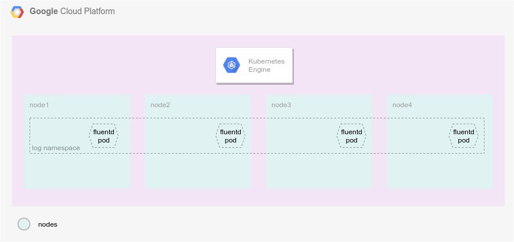
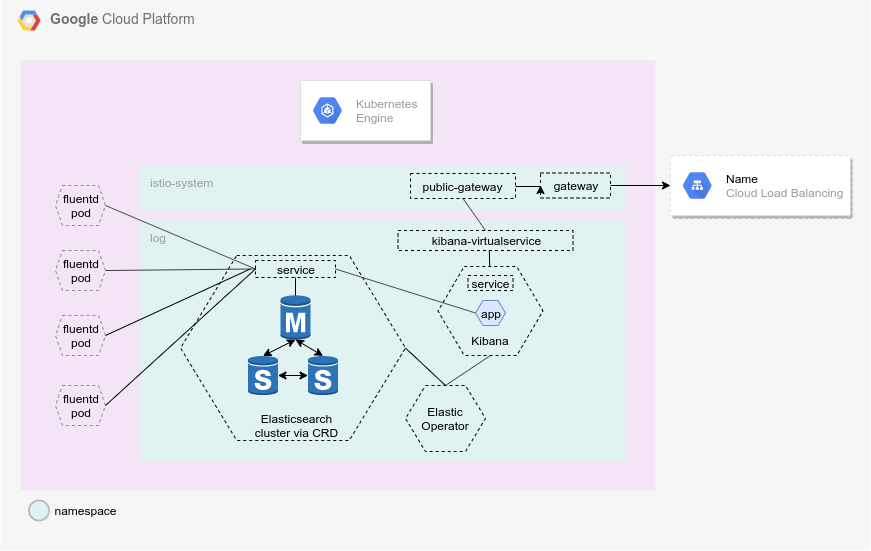

# GKE EFK Logging

Introduction
---

It is a fact that logging can become a problem if not standardize in the day 0. 
Problems in production will arrise and the team needs as many tools as possible 
to debug and fix errors. Business people can take advantage of application logs
to have metrics over the product and define objective business goals. This repo 
tries to standardize the log management as though as the application management 
in order to speed up development best practices arround well know market apps 
such as Elasticsearch and Kibana.  

The Elastickstack is rich with features and components, including metrics ingestors 
for a bunch of variaties of sources, and this repo introduces a new component 
called Fluentd. Fluentd is a powerfull log agreggator and have it has a tremendous 
advantage over the Elastickstack default log agreggator components. You can find 
deep technical studies on how Fluend is superior to the other options.

This repo is to be used together with the GKE Bootstrapper, but it is not a 
requirement. The things you need are:

   - Kubernetes Cluster
   - Istio 1.8 or above

Although using the GKE Bootstrapper is not necessary, it is higly recommended. 
The reason is because you will not need to modify any of the source code to have 
a working logging solution. If you have your cluster in AWS, you will need to 
modify the main `apply.sh` script according to your needs. It is on the roadmap 
of this project to make this repo adjustable depending on the provider, but 
there is no deadline for this feature.


## How to use this repository

To provision necessary resources, use the bellow script.

```
cd src
./apply.sh
```

This stack is built on top of Elastic Stack with a few modifications. First the 
namespace is changed to be `log`. This is a good naming convention as it fits a 
well know best practice of maintaining consistent name lenght for envirolments (e.g. 
`dev`,`hml`,`prd`,`mon`,`cid`). We use Elastic Kubernetes CRD's to build most of 
the important stuff here. Instead of managing StatefulSets and Deployments, we are 
able to manage CRD's named Elasticsearch and Kibana. This is a really powerfull 
feature of Kubernetes and Elastic team have worked their ass of to make this work.

The logs are aggregated by an agent called Fluentd. This aggent is "installed" on 
all nodes via a Kubernetes resouce named Daemonset. These pods will collect all 
container logs from all nodes and foward then to the Elasticseach cluster. Again, 
we can garrantee some consistency because now all our applications can log to stdout 
instead of implementing weird logics. The diagram bellow explain how this is setup:



Within the `log` namespace, the bellow diagram shows what are the resouces deployed 
to the cluster plus the interactions between each one of then:




echo $(kubectl get secret -n log elasticsearch-es-elastic-user -o=jsonpath='{.data.elastic}' | base64 --decode)

```
DOMAIN="arakaki.in"
kubectl apply -f - <<EOF
apiVersion: networking.istio.io/v1alpha3
kind: VirtualService
metadata:
  name: kibana
  namespace: log
spec:
  hosts:
   - "kibana-log.${DOMAIN}"
  gateways:
  - public-gateway.istio-system.svc.cluster.local
  http:
  - route:
    - destination:
        host: kibana-kb-http
        port:
          number: 5601
EOF
```

# TODO:

 - configure new user and password for fluentd instead of using default elastic operator
 - configure pvc to big disk and use the different storage class (for HA)
